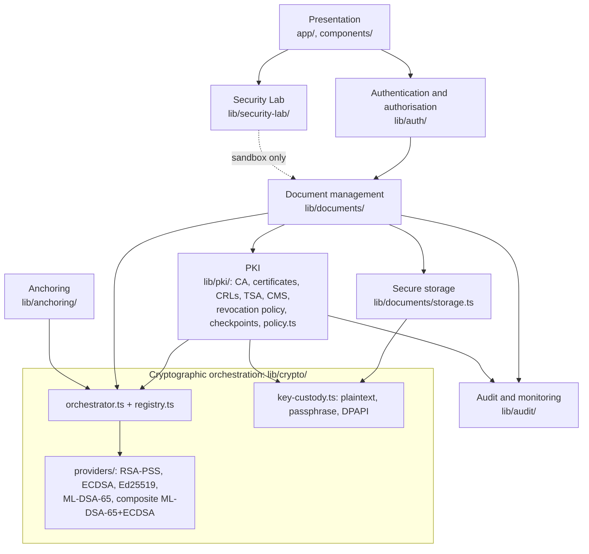
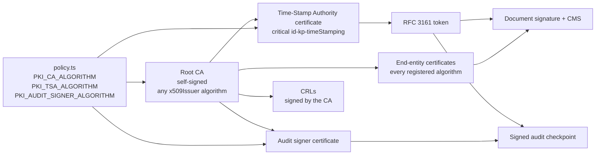
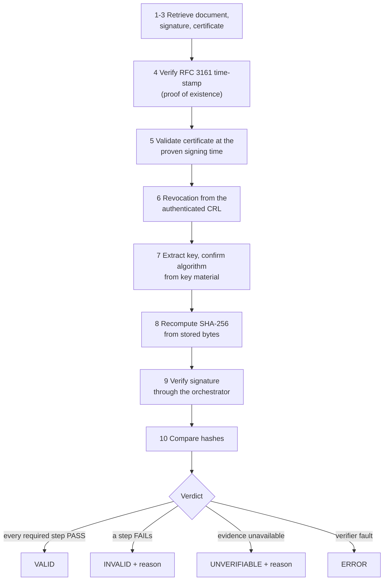
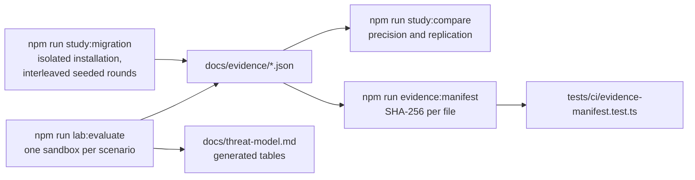

# Architecture diagrams

Diagrams of the system as it is implemented, drawn from the code rather than from the original report's figures. They render on any Markdown viewer that supports Mermaid. File paths name where each element lives.

## Layers

Each layer depends only on the layers beneath it. The dashed box is the only place algorithm-specific code may appear; `npm run check:boundary` enforces it.

## Trust chain and installation policy

Which algorithm each trust service signs with is installation policy (`lib/pki/policy.ts`), fixed when the service is created. The defaults are ECDSA P-256; a post-quantum CA is `PKI_CA_ALGORITHM=ML_DSA_65`.

## Verification and verdicts

Ten steps against the stored bytes. INVALID requires positive evidence; missing or unauthenticated evidence gives UNVERIFIABLE; a verifier fault gives ERROR. The four verdicts are never merged.

## Evidence pipeline

How measured claims reach the paper without being retyped.

